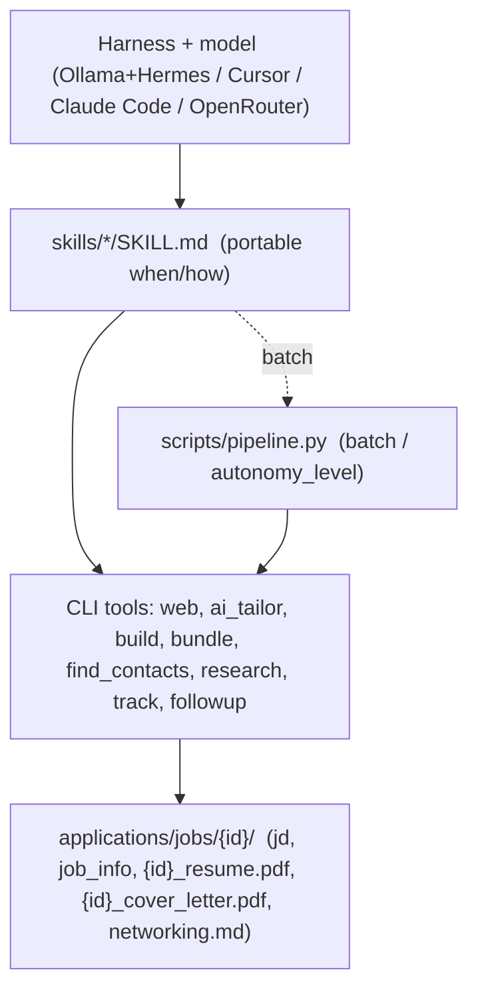

# Job Search

A **harness-agnostic toolbox** for automating a tech job search end to end: discover roles,
tailor a resume + cover letter, draft networking outreach, research companies, track
applications, and follow up — fully autonomously or one step at a time.

The project is deliberately **not** a single hard-wired agent. It is a set of portable
**skills** (markdown instructions) plus callable **tools** (CLI scripts). Whatever
model/harness you plug in becomes the "brain":

- **Local & free first:** a tool-use Ollama model (e.g. `qwen3.6:27b`) under a harness
  like Hermes, VS Code chat, Claude Code, or Cursor.
- **Cloud when quota allows:** Anthropic (`claude-opus-4-7`) / OpenAI / OpenRouter via the same scripts.

This public repo ships with **template/example data** so you can explore the tooling without
exposing personal information. Your real data lives in a **private git submodule** at
`private/` and is picked up automatically (see [Private data & the overlay](#private-data--the-overlay)).

> New to the design? Read [`CONTEXT.md`](CONTEXT.md) (glossary),
> [`okf/index.md`](okf/index.md) (OKF knowledge bundle), and
> [`docs/adr/`](docs/adr) (why key decisions were made).

---

## How it works



- **Skills** (`skills/<name>/SKILL.md`) tell the harness *when* and *how* to do something
  (preferred path in an agent session).
- **Tools** (`scripts/*.py`) do the actual work and can be invoked from any shell.
- **Batch pipeline** (`pipeline.py`) chains tools for unattended runs — optional when a
  harness can follow a skill step-by-step.
- **Bundle**: every application gets one folder, `applications/jobs/<id>/`, holding everything
  you upload — see [The application bundle](#the-application-bundle).

### The Saved ceiling (safety)

No matter how autonomous a run is, the automation **never submits an application** and
**never sends a message**. The maximum action it takes is preparing the bundle and logging the
application as `Saved`. You upload the files and send outreach yourself. (See
[`docs/adr/0002-autonomy-ceiling.md`](docs/adr/0002-autonomy-ceiling.md).)

### Web access (harness-native first)

When your harness already provides web search and page extraction (Hermes `web_search` /
`web_extract`, Cursor browser MCP, Anthropic `web_search`), **use those tools directly**.
Do not invoke `scripts/web.py` from an agent session.

`scripts/web.py` is the **fallback** for standalone terminal runs and scripted pipelines.
Set `WEB_BACKEND` explicitly in `.env` (`searxng` | `tavily` | `brave` | `serper` | `harness`)
plus that backend's URL/key or harness adapters — there is no implicit default. See
[`okf/architecture/web-access-policy.md`](okf/architecture/web-access-policy.md).

---

## Setup (one time)

```bash
# 1. Install uv (recommended runner / dependency manager)
#    macOS / Linux:
curl -LsSf https://astral.sh/uv/install.sh | sh
#    Windows (PowerShell):
#    powershell -c "irm https://astral.sh/uv/install.ps1 | iex"
#    or: pip install uv

# 2. Clone and sync dependencies
git clone https://github.com/yourusername/job-search
cd job-search
uv sync

# 3. Configure settings (LLM + web). Copy the example and edit:
cp .env.example .env
#    For scripted web: set WEB_BACKEND=… (required — no default)

# 4. (Optional) Add your private data submodule — see below
git submodule add git@github.com:YOUR_USER/job-search-private.git private
git submodule update --init private
#    NOTE: if you cloned/forked this repo, .gitmodules points at the original
#    author's private repo, which you cannot access. Either edit .gitmodules to
#    point at your own private repo (then `git submodule sync`) or remove the
#    submodule entry entirely (`git rm --cached private` + delete the
#    .gitmodules entry) and run without the overlay.

# 5. (Optional) Install LaTeX for PDF compilation (TeX Live or MiKTeX)
#    Needed for --pdf / --bundle. Without it, scripts still generate .tex files.
```

Run any tool with `uv run`, e.g. `uv run scripts/pipeline.py --help`.

---

## Settings

There are two places to configure the project: **`.env`** (secrets + runtime providers) and
**`config/job_search_config.yaml`** (search preferences + automation behavior). When the
private overlay is present, the versions under `private/` win.

### `.env` — providers and keys

| Variable | Purpose |
|----------|---------|
| `LLM_PROVIDER` | `ollama` (local) \| `anthropic` \| `openai` (also covers OpenRouter/LM Studio/vLLM) |
| `LLM_MODEL` | Global default model for the active provider (e.g. `qwen3.6:27b`, `claude-opus-4-7`) |
| `LLM_MODEL_TAILOR` / `LLM_MODEL_AUDIT` / `LLM_MODEL_RESEARCH` / `LLM_MODEL_DISCOVERY` / `LLM_MODEL_FOLLOWUP` | Optional per-task pins — used only with `--use-agent` |
| `OLLAMA_BASE_URL` / `OLLAMA_MODEL` | Local Ollama endpoint + model (see `.env.example`) |
| `ANTHROPIC_MODEL` | Anthropic model when no `LLM_MODEL*` is set |
| `ANTHROPIC_API_KEY` | Needed when `LLM_PROVIDER=anthropic` (default model: `claude-opus-4-7`) |
| `OPENAI_BASE_URL` / `OPENAI_API_KEY` / `OPENAI_MODEL` | Any OpenAI-compatible endpoint (OpenRouter, LM Studio, vLLM; default model: `gpt-4o`) |
| `WEB_BACKEND` | Required for scripted web I/O: `searxng` \| `tavily` \| `brave` \| `serper` \| `harness` |
| `SEARXNG_URL` | SearXNG instance when `WEB_BACKEND=searxng` (default `http://127.0.0.1:8888`) |
| `HARNESS_WEB_SEARCH_CMD` / `HARNESS_WEB_FETCH_CMD` | Adapters when `WEB_BACKEND=harness` |
| `TAVILY_API_KEY` / `BRAVE_API_KEY` / `SERPER_API_KEY` | Keys for the matching `WEB_BACKEND` |
| `ENRICHMENT_PROVIDER=hunter` + `HUNTER_API_KEY` + `--domain` | Optional paid contact lookup (off by default; Hunter only) |

> **Web access is required** for discovery, research, and contact-finding when running
> scripts standalone, and `WEB_BACKEND` must be set explicitly (scripts exit with a clear
> message when it isn't). Agent harnesses with built-in web tools do not need `WEB_BACKEND`.
> A free option is a self-hosted [SearXNG](https://docs.searxng.org/) — set
> `WEB_BACKEND=searxng` and point `SEARXNG_URL` at it. Or pick a hosted API and provide its key.

### `config/job_search_config.yaml` — preferences + automation

Tune `target_roles`, `target_companies`, `search_terms`, `profile.preferred_locations`,
`networking` (including `follow_up_delay_days` and `alumni_networks`), and automation:

```yaml
automation:
  # discover_only : find + shortlist jobs only
  # tailor        : also tailor resume / cover letter / outreach drafts
  # full_bundle   : also research, build PDFs, audit, finalize the bundle, log "Saved"
  autonomy_level: full_bundle
  max_jobs: 5
  build_pdf: true            # compile PDFs (needs pdflatex)
  # web_backend: searxng     # optional; env WEB_BACKEND wins. One of them must be set
                             # explicitly for scripted web I/O — there is no default.
  contact_enrichment: false  # reminder only — enrichment is controlled by .env + CLI
```

`config/platforms.yaml` is an **agent playbook** (board filters, career URLs, apply checklists).
It is not loaded by Python scripts today — see
[`okf/glossary/platform-playbook.md`](okf/glossary/platform-playbook.md).

---

## Private data & the overlay

The public repo holds **example** profile/config so the tooling runs out of the box. Your real,
sensitive data lives in a **separate private repo** mounted as a submodule at `private/`.

**How routing works** (`scripts/data_paths.py`): when `private/profile/` exists, every script
reads and writes your data under `private/` instead of the public templates, and `.env` is read
from `private/.env` first. Nothing else needs to change — the same commands operate on your real
data automatically.

Your private repo should mirror this structure:

```
private/
├── .env                      # your API keys / endpoints (never on a public remote)
├── config/job_search_config.yaml
├── profile/                  # real contact info, experience, projects, skills, summaries
├── resume/outputs/           # per-job resume sources + builds ({id}.py/.tex/.pdf)
├── coverletter/outputs/      # per-job cover letter sources + builds ({id}_cl.py/.tex/.pdf)
├── applications/
│   ├── tracker.csv           # your master application log
│   ├── shortlists.md         # optional agent discovery shortlist log
│   └── jobs/<id>/            # one bundle folder per application
└── networking/               # connections.csv, message templates, strategy
```

> The `profile/` directory is **read-only** to agents unless you explicitly ask to update it.
> Tailoring never edits `profile/` — job-specific changes go into `resume/outputs/<id>.py`
> and `coverletter/outputs/<id>_cl.py` via `dataclasses.replace()`.

---

## Usage

### Agent discovery (preferred in a harness)

Follow [`skills/discover-jobs/SKILL.md`](skills/discover-jobs/SKILL.md): shortlist open roles
in chat, append a session to `applications/shortlists.md`, then hand accepted jobs to
`new-application` / `ai_tailor`. Use harness-native web — do not call `scripts/web.py`.

### Run the whole pipeline (scripted / unattended)

`scripts/pipeline.py` chains **discover → tailor → research → build → audit → bundle →
track(Saved)**, stopping at your configured `autonomy_level`.

```bash
# Use config defaults (autonomy_level + max_jobs); opt in to project web
uv run scripts/pipeline.py --use-project-web

# Override how far it goes / how many jobs
uv run scripts/pipeline.py --level tailor --max 3 --use-project-web
uv run scripts/pipeline.py --query "LLM inference engineer remote" --max 5 --use-project-web

# A single known posting, end to end
uv run scripts/pipeline.py --url "https://careers.example.com/123" --id acme_ml_2026 --use-project-web
uv run scripts/pipeline.py --jd jd.txt --id acme_ml_2026   # local JD — no web flag

# Piecewise on an existing application (skip discovery)
uv run scripts/pipeline.py --id acme_ml_2026 --steps build,bundle,track
uv run scripts/pipeline.py --id acme_ml_2026 --steps audit     # audit only

# Pause for confirmation before each per-job step
uv run scripts/pipeline.py --gate --use-project-web
```

`--use-project-web` is required for unattended discovery/fetch/research/contacts (ADR 0004).
`WEB_BACKEND` must be set in `.env` (`searxng` | `tavily` | `brave` | `serper` | `harness`).
`--search-mode` is retired. Discovery helpers are in `job_discovery.py` (library only).
The `audit` step runs at `full_bundle` and writes advisory `audit.md`; it never edits
profile or per-job outputs sources.

### Run steps individually (manual / piecewise)

```bash
# Discover jobs (scripted preview / batch) — agents prefer the discover-jobs skill
uv run scripts/pipeline.py --max 5 --dry-run --use-project-web
uv run scripts/pipeline.py --max 5 --build --use-project-web

# AI-tailor straight from a JD (writes the whole bundle scaffold)
uv run scripts/ai_tailor.py --url "https://..." --id acme_ml_2026 --use-project-web
uv run scripts/ai_tailor.py --jd jd.txt --id acme_ml_2026

# Manual scaffold without AI
uv run scripts/new_application.py --id acme_ml_2026 --company Acme --role "ML Engineer"
# ...edit resume/outputs/acme_ml_2026.py + coverletter/outputs/acme_ml_2026_cl.py...

# Audit the tailored documents before submitting (also a pipeline step)
uv run scripts/audit.py --id acme_ml_2026

# Build + finalize the upload bundle (compile PDFs, move into the app folder, clean temp)
uv run scripts/build.py --id acme_ml_2026 --bundle
uv run scripts/bundle.py --id acme_ml_2026        # finalize only

# Web search / page fetch (requires WEB_BACKEND)
uv run scripts/web.py search "ML engineer remote 2026" --max 8
uv run scripts/web.py fetch "https://example.com/job/123"

# Research a company/topic into a sourced brief (unattended runs need the web opt-in)
uv run scripts/research.py "Anthropic interview process" --id acme_ml_2026 --focus "interview prep" --use-project-web

# Find networking contacts (queries + public pages; no LinkedIn scraping).
# Without --use-project-web it emits search queries only (no page scan).
uv run scripts/find_contacts.py --company Acme --role "ML Engineer" --id acme_ml_2026 --use-project-web

# Track applications
uv run scripts/track.py log    --id acme_ml_2026 --platform "Company Website" --url https://...
uv run scripts/track.py update --id acme_ml_2026 --status "Phone Screen"
uv run scripts/track.py list

# Follow up on stale applications (drafts only — never sends)
uv run scripts/followup.py --list-only
uv run scripts/followup.py

# Validate profile imports / inventory (read-only)
uv run scripts/validate_profile.py --inventory
uv run scripts/validate_profile.py
```

---

## The application bundle

Every application ends up as one self-contained folder you can upload from:

```
applications/jobs/<id>/
├── jd.txt                    # saved copy of the job description
├── job_info.py               # company, role, url, keywords, networking targets
├── <id>_resume.py            # resume source (after --bundle)
├── <id>_resume.tex           # kept for future manual recompiles
├── <id>_resume.pdf           # ← upload this
├── <id>_cover_letter.py
├── <id>_cover_letter.tex
├── <id>_cover_letter.pdf     # ← upload this
├── networking.md             # drafted outreach + contacts + follow-ups (never auto-sent)
├── research.md               # optional company/role research brief
└── audit.md                  # optional pre-submit critique
```

Before bundling, sources live under:

| Kind | Path |
|------|------|
| Resume | `resume/outputs/<id>.{py,tex,pdf}` |
| Cover letter | `coverletter/outputs/<id>_cl.{py,tex,pdf}` |

`bundle.py` (or `build.py --bundle`) **moves** `.py` / `.tex` / `.pdf` into the job folder as
`{id}_resume.*` / `{id}_cover_letter.*` and deletes LaTeX temp files:
`.aux .log .out .toc .lof .lot .fls .fdb_latexmk .synctex.gz .nav .snm .vrb .bbl .blg`

---

## Skills

Portable instructions in `skills/<name>/SKILL.md`, each paired with a CLI tool or templates:

| Skill | Tool | Use when |
|-------|------|----------|
| `run-pipeline` | `pipeline.py` | Run the whole thing E2E or piecewise (batch) |
| `discover-jobs` | harness web + optional `pipeline.py` | Shortlist open roles; hand off accepted jobs |
| `new-application` | `new_application.py` / `ai_tailor.py` | Scaffold or fully prep one application |
| `tailor-resume` | agent or `ai_tailor.py` | Tailor the resume from a JD |
| `tailor-coverletter` | agent or `ai_tailor.py` | Tailor the cover letter from a JD |
| `build-documents` | `build.py` / `bundle.py` | Render `.tex`, compile PDFs, finalize the bundle |
| `research` | harness web or `research.py` | Research a company/topic into a brief |
| `find-contacts` | harness web or `find_contacts.py` | Find recruiters/hiring managers |
| `networking-outreach` | (templates) | Draft LinkedIn/email outreach |
| `follow-up` | `followup.py` | Surface + draft follow-ups for stale apps |
| `audit-application` | agent or `audit.py` | Critique resume/CL before submitting |
| `track-application` | `track.py` | Log/update applications in `tracker.csv` |
| `update-profile` | (edit `profile/` +) `validate_profile.py` | Edit `profile/` — ONLY on explicit command; then validate |

---

## Project structure

```
job-search/
├── CONTEXT.md               ← glossary (harness, skill, tool, bundle, shortlist, ...)
├── okf/                     ← OKF v0.1 knowledge bundle for agents and humans
├── docs/adr/                ← architecture decision records
├── LICENSE                  ← MIT
├── private/                 ← your private git submodule (real data) — overlays the templates
├── profile/                 ← template/example data (public; read-only to agents)
├── resume/                  ← LaTeX engine + outputs/ (templates in tailoring/)
│   ├── outputs/             ← {id}.py / .tex / .pdf
│   └── tailoring/_template.py
├── coverletter/             ← LaTeX engine + outputs/ (`{id}_cl.*`)
│   ├── outputs/
│   └── tailoring/_template.py
├── applications/            ← tracker + shortlists + per-job bundles
│   ├── tracker.csv
│   ├── shortlists.md        ← agent discover-jobs sessions (create if absent)
│   └── jobs/
│       ├── _template/
│       └── <id>/
├── networking/              ← strategy, message templates, connections
├── config/                  ← job_search_config.yaml + platforms.yaml (playbook; agent-only)
├── skills/                  ← SKILL.md files (portable instructions)
│   ├── audit-application/
│   ├── build-documents/
│   ├── discover-jobs/
│   ├── find-contacts/
│   ├── follow-up/
│   ├── networking-outreach/
│   ├── new-application/
│   ├── research/
│   ├── run-pipeline/
│   ├── tailor-coverletter/
│   ├── tailor-resume/
│   ├── track-application/
│   └── update-profile/
├── tests/                   ← pytest suite (`uv run pytest`)
└── scripts/
    ├── pipeline.py          ← E2E orchestrator (autonomy_level; --use-project-web)
    ├── job_discovery.py     ← discovery library (no CLI; used by pipeline)
    ├── ai_tailor.py         ← JD → tailored resume/CL/outreach
    ├── audit.py             ← hiring-manager critique → audit.md
    ├── new_application.py   ← scaffold a bundle without AI tailoring
    ├── build.py / bundle.py ← compile + finalize the upload bundle
    ├── web.py               ← search + fetch (pluggable backend; explicit WEB_BACKEND)
    ├── research.py          ← company/topic research briefs
    ├── find_contacts.py     ← contacts via queries + public pages
    ├── followup.py          ← follow-up surfacing + drafting
    ├── track.py             ← application tracker
    ├── validate_profile.py  ← profile validation + inventory
    ├── llm_provider.py      ← provider-agnostic LLM access
    ├── json_llm.py          ← JSON-mode LLM helper (shared by AI tools)
    ├── text_utils.py        ← shared text helpers
    ├── job_info_io.py       ← safe job_info.py reads/writes
    ├── bootstrap.py         ← shared CLI bootstrap (paths + env)
    └── data_paths.py        ← private overlay + {id} / {id}_cl document paths
```

---

## Requirements

- Python 3.10+ and [uv](https://docs.astral.sh/uv/)
- An LLM configured in `.env` (local Ollama, or a cloud key)
- Web backend for **scripted** discovery/research/contacts when no harness web tools exist
  (set `WEB_BACKEND` in `.env` — e.g. a self-hosted SearXNG or a hosted API key);
  harness-native web needs no `WEB_BACKEND`
- LaTeX (TeX Live or MiKTeX) for PDF compilation (`--pdf` / `--bundle`)

---

## License & contributions

Licensed under the [MIT License](LICENSE) — free to use, modify, and fork.

This is a personal project shared as-is. Contributions are not actively solicited,
but pull requests are welcome; all merges require the maintainer's review and
approval. Please open an issue first for anything larger than a small fix.
