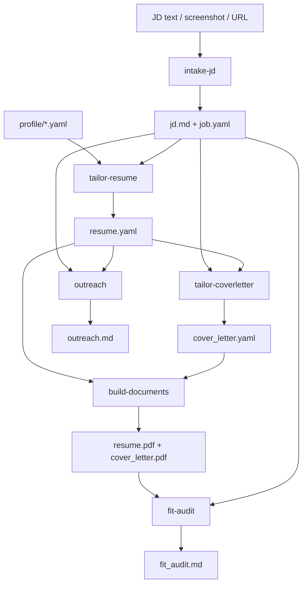

# Workstream 08 — `apply` Orchestrator Skill

> **Depends on workstreams 01–07.** This is the last piece before cleanup; it composes
> what they built and owns no logic of its own.
>
> **Before writing anything, run a `grill-with-docs` session** (the `grilling` skill via
> `domain-modeling`): one question at a time, each with your recommended answer, resolving
> the open questions below. Look facts up in the repo yourself; put only decisions to the
> user. Do not implement until the user confirms shared understanding.

## Goal

One entry point that takes a job description and walks it through to a finished
application folder, by calling the stage skills in order. Nothing more.

## Decisions already locked

- **Thin.** The orchestrator contains no tailoring, extraction, or authoring logic. If a
  rule belongs to a stage, it lives in that stage's skill.
- **File-passing stages.** Every stage reads its input from files in the job folder and
  writes its output there. Any stage can be re-run alone without redoing the earlier ones
  — that is the property that makes debugging cheap: hand-fix `job.yaml`, re-run tailoring
  only.
- The batch pipeline is gone. `scripts/pipeline.py`, `autonomy_level`, and
  `--use-project-web` are all deleted. This orchestrator is a *skill* the agent follows,
  not a Python script driving an agent.
- Zero LLM calls in Python.

## The pipeline it composes



Target job folder contents when everything has run:

```
applications/jobs/<id>/
  jd.md
  job.yaml
  resume.yaml
  resume.tex
  resume.pdf
  cover_letter.yaml      (if a letter was requested)
  cover_letter.tex
  cover_letter.pdf
  outreach.md            (if outreach was requested)
  fit_audit.md           (if audited)
```

## Current state

- `skills/new-application/SKILL.md` and `skills/run-pipeline/SKILL.md` are the
  predecessors, both being deleted. Read them for the failure modes they accumulated.
- `scripts/pipeline.py` chained discover → tailor → research → build → audit → bundle →
  track with an `autonomy_level` config knob and a `--gate` flag for per-step
  confirmation. Most of that vanishes with the removed stages, but the **gate** idea and
  the **hard ceiling** are worth carrying forward.
- The **Saved ceiling** in [CONTEXT.md](../../CONTEXT.md): the automation never submits an
  application and never sends a message. Preparing files is the maximum action. That rule
  survives this revamp and should be restated here, even though the tracker that recorded
  `Saved` is gone.

## Scope

**In scope**
- `skills/apply/SKILL.md`: the ordered composition, which stages are default versus
  opt-in, where the user is asked to approve, and how to resume a partially completed
  folder.
- Failure handling: what happens when a stage fails, and how the user restarts from there.
- The state model — how the orchestrator knows which stages have already run.

**Out of scope**
- Any logic belonging to a stage. If something feels like it belongs here but is really a
  stage rule, push it back to that stage.
- Bringing back tracking, discovery, or batch runs.

## Grill the user on these before implementing

1. **Default stage set.** Which stages run by default on "apply to this job"? Cover letter
   and outreach were both scoped as on-demand in their workstreams; fit-audit is
   analysis. *Recommend intake, tailor-resume, build, fit-audit by default, with cover
   letter and outreach on request.*
2. **Approval gates.** Where does the flow stop for the user — after extraction, after
   `resume.yaml`, after the PDF, nowhere? Every gate costs a round trip; too few and a
   bad decision propagates. *Recommend one gate on `resume.yaml` before build, since that
   is where a wrong choice is cheapest to fix and most expensive to miss.*
3. **State detection.** Should the orchestrator infer completed stages from which files
   exist, or keep an explicit status file in the folder? *Recommend inferring from files —
   no second source of truth to fall out of sync, and hand-deleting a file is an obvious
   way to force a re-run.*
4. **Stage failure.** Stop immediately, or continue with the stages that do not depend on
   the failed one? *Recommend stopping and reporting, since almost everything depends on
   intake and tailoring.*
5. **Resuming.** When run over a partially complete folder, re-run only what is missing,
   or ask? *Recommend re-running only missing stages and reporting what was skipped.*
6. **Naming.** Is `apply` the right skill name, given that the one thing it never does is
   apply? *Recommend `prepare-application` or similar — the Saved ceiling means nothing
   here submits anything, and the name should not imply otherwise.*
7. **Batch.** Does the user ever want several JDs processed in one go, or is this strictly
   one at a time? *Recommend one at a time — batch was a major source of the deviation
   problem that triggered this revamp.*
8. **Progress reporting.** How much does the agent narrate between stages? *Recommend a
   one-line summary per stage plus the artifact path, and full detail only at the gate.*

## Done criteria

- `skills/apply/SKILL.md` (or the agreed name) exists, is short, and delegates every
  decision to a stage skill.
- Running it end to end on a real JD produces a complete job folder.
- Deleting one artifact and re-running regenerates exactly that stage and nothing else.
- The no-submit, no-send ceiling is stated explicitly in the skill.
- [CONTEXT.md](../../CONTEXT.md) is updated: `autonomy_level`, **Batch pipeline**, and
  **Shortlist** are removed or rewritten, and the **Saved ceiling** entry is restated
  without the tracker.
